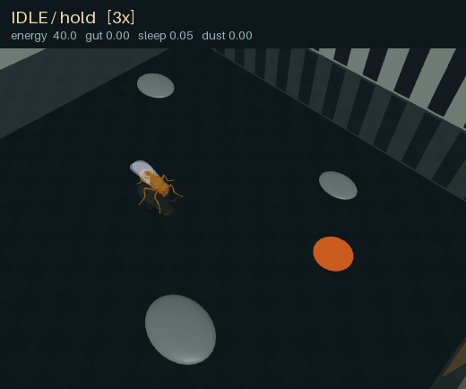
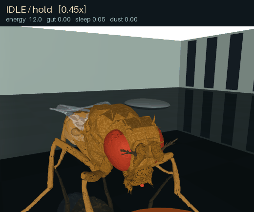
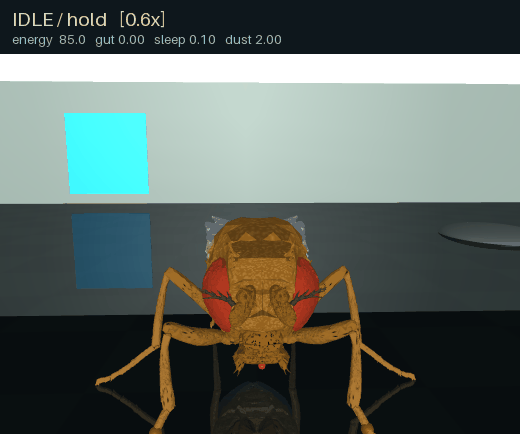
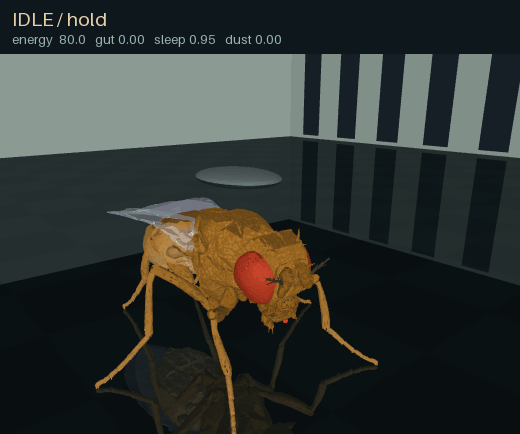

# Fly Arena

A local fruit-fly simulation combining a physical NeuroMechFly body in MuJoCo,
MaleCNS connectome data, and explicit behavioral controllers.

The main hybrid mode supports walking, odor-guided food search, contact-based
feeding through an articulated proboscis, grooming, sleep pressure, and waking.
A separate two-fly arena adds shared food, body collisions, pushing, foreleg
fencing, and retreat. These behaviors combine simulated physiology with
engineered decisions and motor programs. This is an experimental model, not a
physiologically validated digital fly.

| Odor-guided search | Feeding through the proboscis |
|---|---|
|  |  |
| Foreleg grooming | Sleep and tactile waking |
|  |  |

These clips show the engineered behavioral and motor controllers with the
connectome disabled. Playback speeds vary between clips.

## Quick start on Windows

Use **64-bit Python 3.12** and an OpenGL-capable graphics driver. Neural dynamics
and physics run on the CPU; CUDA and PyTorch are not required. Allow several GB
of disk space for the environment, downloaded data, and generated output.
Real-time performance depends on your CPU. The first neural run includes Numba
compilation.

Clone the repository and run commands from its root:

```powershell
git clone https://github.com/artem-x-meta/fly-arena.git
cd fly-arena
py -3.12 -m venv .venv
.\.venv\Scripts\python.exe -m pip install -e .
.\.venv\Scripts\python.exe -m fly_arena run --mode body-demo --seconds 3
```

The last command checks the physical body and viewer with scripted walking;
it does not load a connectome. Alternatively, use `launchers/01_setup_windows.cmd` and
then `launchers/02_test_body.cmd`.

Prepare the neural graph, then start the hybrid arena:

```powershell
.\.venv\Scripts\python.exe -m fly_arena prepare
.\.venv\Scripts\python.exe -m fly_arena run --mode ethology-hybrid --config configs/ethology-fast.toml --seconds 0
```

`prepare` downloads approximately **1.11 GB** of public MaleCNS v1.0 source data,
verifies SHA-256 hashes, and builds a sparse graph in `data/graph/`. Downloads
can resume after interruption. No neuPrint account or token is required.
Subsequent runs use local data.

In the viewer, drag or scroll to move the camera, press **Space** to pause,
and close the window or press **Ctrl+C** in the console to stop. In hybrid
mode, **W** applies a local tactile wake stimulus. `--seconds` means simulated
seconds; `0` keeps running until stopped. `--wall-seconds` can limit wall time
for the hybrid arena after loading.

Windows launch scripts are grouped in `launchers/`. They locate the project
root automatically, so they can be started from any working directory.

## Available demonstrations

| Launcher | Demonstration | Prepared graph needed |
|---|---|---|
| `launchers/02_test_body.cmd` | Scripted walking and installation check | No |
| `launchers/04_run_connectome.cmd` | LIF activity driving descending gait commands | Yes |
| `launchers/05_run_ethology.cmd` | Feeding, grooming, sleeping, and walking | Yes |
| `launchers/07_run_search.cmd` | Odor-plume search with recurring food and dust | Yes |
| `launchers/09_run_escape.cmd` | Approaching visual object and engineered escape | Yes |
| `launchers/13_run_food_fight.cmd` | Two flies sharing a scarce food supply | No |
| `launchers/15_run_shared_meal.cmd` | The same encounter with more food available | No |

The `demo-fast` profile accelerates organism processes such as metabolism and
sleep pressure by 60 times. Physics and neural time retain their normal scale.
Use `configs/ethology-unscaled.toml` for an organism time scale of one.
Food, energy, and contamination use model-specific units.

The two-fly demonstration can also be started directly:

```powershell
.\.venv\Scripts\python.exe -m fly_duel --social --scene encounter --single --seed 1 --seconds 12 --viewer
.\.venv\Scripts\python.exe -m fly_duel --social --scene encounter --single --seed 1 --seconds 12 --resources ample --viewer
```

Each contestant has its own organism state, navigator, and motor controller.
Actual feeding draws from a shared finite resource. Failed feeding, remaining
hunger, recent food contact, and local rival sensing drive the social policy;
successful intake suppresses escalation. The motions include physical pushing
and foreleg fencing, but do not reconstruct biological lunges or the full
aggression repertoire. This mode runs engineered controllers without a neural
graph. Its scarcity scenario can escalate after the food has been consumed;
it does not establish a winner's advantage in access to remaining food.

## Headless runs and checkpoints

Record a short feeding scenario without opening the viewer:

```powershell
.\.venv\Scripts\python.exe -m fly_arena run --headless --scenario feeding-contact --seconds 3 --video runs/feed.mp4
```

On Linux, use Python 3.12 and `bash setup_linux.sh`. Replace the Windows Python
path with `.venv/bin/python`; use `--headless --gl egl` when running without a
desktop and with a working EGL backend.

Outputs go to `runs/`: telemetry, metadata, optional video, and checkpoints.
Hybrid-mode checkpoints contain physics, neural and organism state, resources,
controller state, filters, and random generators. Continue a saved run with:

```powershell
.\.venv\Scripts\python.exe -m fly_arena run --resume runs/checkpoints/latest.npz --seconds 10
```

Here, `--seconds` adds simulation time and configuration comes from the
checkpoint. Compatibility checks include code, dependencies, graph, and model
fingerprints, so checkpoints from another source revision may be rejected.
The older `connectome` mode saves neural state for analysis, not a complete
resumable arena.

## Neural model and research limits

The prepared graph retains **166,700 annotated non-glial entries** and all
**25,582,938 connection rows** between them, including weak and self connections.
Weights derive from synapse counts, simplified transmitter signs, and a global
gain. The default backend uses uniform leaky integrate-and-fire neurons with
explicit background and descending-neuron stimulation. These dynamics and input
choices are project implementations, not physiological parameters supplied or
validated by the connectome authors.

Two 96 x 96 cameras provide approximate retinal input. Descending activity is
converted to gait commands, while FlyGym supplies an engineered walking
controller. Motor neurons are not individually mapped to muscles. In hybrid
mode, food search, behavioral arbitration, and escape detection also contain
engineered logic. Running the full graph does not demonstrate that natural
behavior emerges from connectivity alone. Flight is not implemented.

Additional research packages remain separate from the main arena:

- `fly_circuit_lab` contains visual-pathway probes and a paper-derived escape
  response model.
- `fly_bio` and `fly_bio_selectivity` contain graded-response and motion
  selectivity experiments. They did not achieve a validated replacement for
  the external visual controller.
- `fly_semantic` and `semantic_tools` explore a small trained neural-activity
  readout for the need for food, with frozen connectome weights and artificial
  input ports. Directional instructions are not yet an operational learned
  navigation interface. The demo requires separately generated calibration,
  mappings, and trained readout artifacts; these are not shipped in this
  repository. Existing semantic labels and console messages are in Russian.

Downloaded datasets, recordings, trained artifacts, local experiment reports,
and development notes are excluded from version control. The source and
configuration files remain available for inspection and further experiments.

## Development and troubleshooting

Install the test extra and run the source test suites:

```powershell
.\.venv\Scripts\python.exe -m pip install -e ".[test]"
.\.venv\Scripts\python.exe -m pytest --import-mode=importlib tests circuit_tests compat_tests duel_tests bio_tests selectivity_tests semantic_tests
```

The import mode allows similarly named test modules in separate directories.
Some integration and experiment-reproduction checks require OpenGL, a prepared
graph, or local generated artifacts. See each test's prerequisites before
enabling them.
Use `python -m fly_arena run --help` and `python -m fly_duel --help` for CLI
options, including diagnostic and ablation controls.

- **Missing prepared connectome:** run `python -m fly_arena prepare` from the
  project root, or set `--data` to the correct data directory.
- **Missing Python:** check `py -3.12 --version`; this dependency set targets
  Python 3.12.
- **Black or clipped viewer:** MuJoCo's side panels are hidden by default due
  to a rendering issue on some drivers. Avoid `--mujoco-ui` on affected systems.
- **Slow first run:** allow Numba compilation to finish. Model seconds are
  independent of wall-clock seconds.

## License and attribution

Project code is available under the [MIT License](LICENSE). Connectome data
come from [MaleCNS v1.0](https://male-cns.janelia.org/download/) under CC BY 4.0.
The physical body and walking controller come from
[NeuroMechFly / FlyGym](https://github.com/NeLy-EPFL/flygym), with physics provided
by [MuJoCo](https://github.com/google-deepmind/mujoco). See
[THIRD_PARTY.md](THIRD_PARTY.md) for attribution, transformations, and dependency
licenses.
